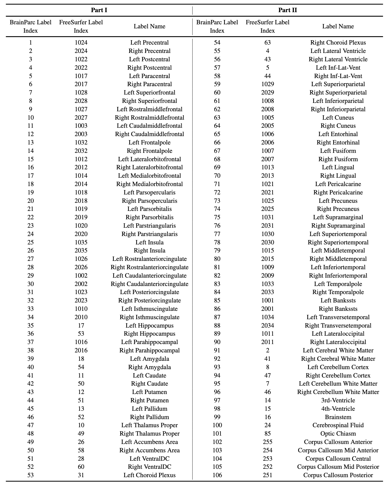

## BrainParc: Unified Lifespan Brain Region Parcellation
Official implementation of Unified Lifespan Brain Region Parcellation from Structural MR Images (**BrainParc**)

***
> "[BrainParc: Unified Lifespan Brain Parcellation with Anatomy-guided Progressive Transmission](https://www.researchgate.net/publication/389177856_BrainParc_Unified_Lifespan_Brain_Parcellation_with_Anatomy-guided_Progressive_Transmission)", _ISMRM_, 2025, [Jiameng Liu, Feihong Liu, Kaicong Sun, Caiwen Jiang, Yulin Wang, Tianyang Sun, Feng Shi and <u>Dinggang Shen</u>]

> "BrainParc: Unified Lifespan Brain Parcellation from Structural MR Images", _Nature Computation Science_, 2025, [Jiameng Liu, Feihong Liu, Kaicong Sun, Zhiming Cui, Tianyang Sun, Zehong Cao, Jiawei Huang, Shuwei Bai, Yulin Wang, Kaicheng Zhang, Caiwen Jiang, Yuyan Ge, Han Zhang, Feng Shi and <u>Dinggang Shen</u>]

***
<div style="text-align: center">
  
</div>

***

### Main Framework
The entire BrainParc framework includes two parts:
1. **`Brain extraction:`** Prerequisit for following brain tissue segmentation and region parcellation. We designed and trained an Automatic skull-strip (AutoStrip) method for lifespan T1w MRI data.

    * You can find the detailed implementation and pretrained model of AutoStrip can in this [Repo](https://github.com/SaberPRC/AutoStrip). This repo mainly introduce the implementation details of the tissue segmentation and region parcellation part of **BrainParc**.

2. **`Tissue segmentation and region parcellation`**: Unified Lifespan Brain Region Parcellation (BrainParc) framework which leverage the anatomical information invariant to intensity and contrast, enabling accurate, robust, and longitudinally consistent parcellation across heterogeneous dataset without the need for fine-tuning.

<div style="text-align: center">
  
</div>

***
### Implementation and Model Training
**`Step 1: Data Preparation`** Organize your project directory as follows to reproduce **BrainParc** on your own data

```shell
Experiments/
├── csvfile/                     # Training, validation, & testing splits
│   └── file_list.csv            # Each line: [IDs, folder, fold]
├── data/                        # Data folder
│   ├── HCPA/
│   │   └── sub001/
│   │       ├── brain.nii.gz      # skull-stripped T1w data
│   │       ├── tissue.nii.gz     # ground-truth tissue maps
│   │       └── dk-struct.nii.gz  # ground-truth dk struture maps
│   ├── HCPD/
│   └── HCPY/
└── Results/
    └── BrainParc/
        ├── checkpoints/        # Saved every 10 epochs
        ├── log/
        │   └── log
        └── pred/               # Validation results per epoch
```


#### **Note:** The relative training, testing, and validation split should be recorded in `file_list.csv`. The example for `file_list.csv` is shown below:

<div align="center" style="width:100%; margin:auto;">

<table style="width:80%; text-align:center; border-collapse:collapse;">
  <tr>
    <th>IDs</th>
    <th>folder</th>
    <th>fold</th>
  </tr>
  <tr><td>sub001</td><td>HCPY</td><td>1</td></tr>
  <tr><td>sub002</td><td>HCPY</td><td>2</td></tr>
  <tr><td>sub003</td><td>HCPY</td><td>3</td></tr>
  <tr><td>sub001</td><td>HCPD</td><td>1</td></tr>
  <tr><td>sub002</td><td>HCPD</td><td>2</td></tr>
  <tr><td>sub003</td><td>HCPD</td><td>3</td></tr>
  <tr><td>sub004</td><td>HCPD</td><td>3</td></tr>
  <tr><td>sub001</td><td>HCPA</td><td>3</td></tr>
</table>

</div>
where folder denote for different datasets and fold used for the training (fold=3), testing (fold=1), and validation (fold=2) split.


### Step 2: Data Prepocessing
You are required performing the following steps for training BrainParc using your own data:
* `Brain Extraction:` Please first remove brain skull using our [AutoStrip](https://github.com/SaberPRC/AutoStrip).

* `Edge Extraction:` Extracte the brain edge maps using sobel filter, you can refer to this [script](./Code/Inference/Step01_Intensity_2_Edge.py) for extract brain sobel edge maps.

  ```shell 
  python ./Code/Inference/Step01_Intensity_2_Edge.py --input /path/to/input/brain.nii.gz --output /path/to/save/extracted/edge/maps
  ```
After the data preprocess, your data directory should be:
```shell
Experiments/
├── csvfile/                     # Training, validation, & testing splits
│   └── file_list.csv            # Each line: [IDs, folder, fold]
├── data/                        # Data folder
│   ├── HCPA/
│   │   └── sub001/
│   │       ├── brain.nii.gz      # skull-stripped T1w data
│   │       ├── brain_edge.nii.gz # extracted brain edge maps
│   │       ├── tissue.nii.gz     # ground-truth tissue maps
│   │       └── dk-struct.nii.gz  # ground-truth dk struture maps
│   ├── HCPD/
│   └── HCPY/
└── Results/
    └── BrainParc/
        ├── checkpoints/        # Saved every 10 epochs
        ├── log/
        │   └── log
        └── pred/               # Validation results per epoch
```

### Step 3: Model Training (BrainParc)
* Please find the implementation of BrainParc in ./Code folder with following format
  ```shell
  Code
  ├── config
  │   ├── __init__.py
  │   └── config.py # Configuration for model training
  ├── dataset
  │   ├── __init__.py
  │   ├── basic.py # Basic function for data loading
  │   └── dataset.py # Data loader
  ├── network
  │   ├── __init__.py
  │   ├── basic.py # Basic function for model construction
  │   └── Joint_Parc_96.py # Main framework for progressive segmentation model
  ├── trainSegNetMS_Joint_DDP.py # Training script using DDP
  └── utils
      ├── __init__.py
      ├── loss.py # Volume-aware adaptive weight loss function
      └── utils.py
  ```

* Training scripts
  ```python
  python -m torch.distributed.run --nproc_per_node=2 --nnodes=1 --master_port 10086 ./Code/trainSegNetMS_Joint_DDP.py --platform bme --save_path ParcJoint --file_list file_list.csv --batch_size 2 --resume -1 --weight 1
  ```


### Inference Using Pretrained Model
We provided three infant and two child/adult samples in [Test_Sample](./Test_Samples). You can also test **BrainParc** on your own data structured as:

```shell
Test_Sample/
├── sub001_infant_infantile/
│   └── brain.nii.gz
├── sub002_infant_isointense/
│   └── brain.nii.gz
├── sub003_infant_adult_like/
│   └── brain.nii.gz
├── sub004_child/
│   └── brain.nii.gz
└── sub005_adult/
    └── brain.nii.gz
```
1. Skull-striping
*  Please first conduct skull-stripping on your own data using our [AutoStrip](https://github.com/SaberPRC/AutoStrip)


2. Brain edge extraction
    ```shell
    python ./Code/Inference/Step01_Intensity_2_Edge.py --input ./Test_Samples/sub001_infant_infantile/brain.nii.gz --output ./Test_Samples/sub001_infant_infantile/brain_edge.nii.gz
    ```
    Run likewise for other data samples with appropriate `--input` and `--output` parameters. The processed data should include the following files:

  `brain.nii.gz`, `brain_edge.nii.gz`


3. Tissue segmentation and region parcellation
    ```shell
    python ./Code/Inference/Step02_BrainParc.py --input_brain ./Test_Samples/sub001_infant_infantile/brain.nii.gz --input_edge ./Test_Samples/sub001_infant_infantile/brain_edge.nii.gz --output_tissue ./Test_Samples/sub001_infant_infantile/tissue.nii.gz --output_dk ./Test_Samples/sub001_infant_infantile/dk-struct.nii.gz
    ```
   * --model_path: pretrained model path
   * --input_brain: path to brain.nii.gz
   * --input_edge: path to brain_edge.nii.gz
   * --output_tissue: path to tissue.nii.gz
   * --output_dk: path to dk-struct.nii.gz

### Pretrained model

You can download our pretrained model through the following link:
* [BrainParc](https://drive.google.com/file/d/1lPccRLPmQrLfcEJ3SlNTRaySwc9Nwu4U/view?usp=sharing)


### ROI Index of BrainParc and Corresponding ROI Index of FreeSurfer
* We segment MRI brain according to dk structrue atlas, each label in our BrainParc are shown below:
<div style="text-align: center">
  
</div>

### [<font color=#F8B48F size=3>License</font> ](./LICENSE)
```shell
Copyright IDEA Lab, School of Biomedical Engineering, ShanghaiTech University, Shanghai, China.

Licensed under the the GPL (General Public License);
you may not use this file except in compliance with the License.
You may obtain a copy of the License at

    http://www.apache.org/licenses/LICENSE-2.0

Repo for BrainParc: Unified Lifespan Brain Parcellation from Structural MR Images
Contact: JiamengLiu.PRC@gmail.com
```

