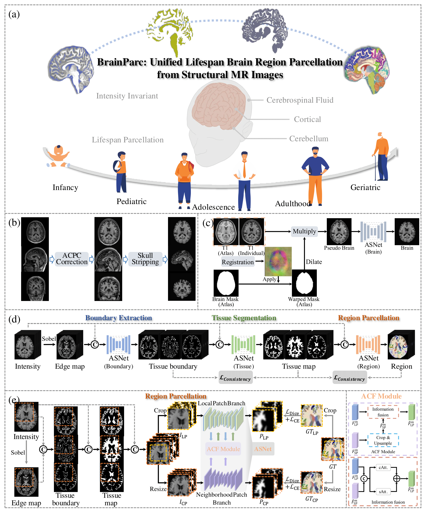

## BrainParc: Unified Lifespan Brain Region Parcellation


> "BrainParc: Unified Lifespan Brain Parcellation from Structural MR Images", _Nature BME_, [Jiameng Liu, Feihong Liu, Kaicong Sun, Zhiming Cui, Tianyang Sun, Zehong Cao, Jiawei Huang, Shuwei Bai, Yulin Wang, Kaicheng Zhang, Caiwen Jiang, Yuyan Ge, Han Zhang, Feng Shi and <u>Dinggang Shen</u>]

***




## [<font color=#F8B48F size=3>License</font> ](./LICENSE)
```shell
Copyright IDEA Lab, School of Biomedical Engineering, ShanghaiTech University, Shanghai, China.

Licensed under the the GPL (General Public License);
you may not use this file except in compliance with the License.
You may obtain a copy of the License at

    http://www.apache.org/licenses/LICENSE-2.0

Repo for BrainParc: Unified Lifespan Brain Parcellation from Structural MR Images
Contact: JiamengLiu.PRC@gmail.com
```

